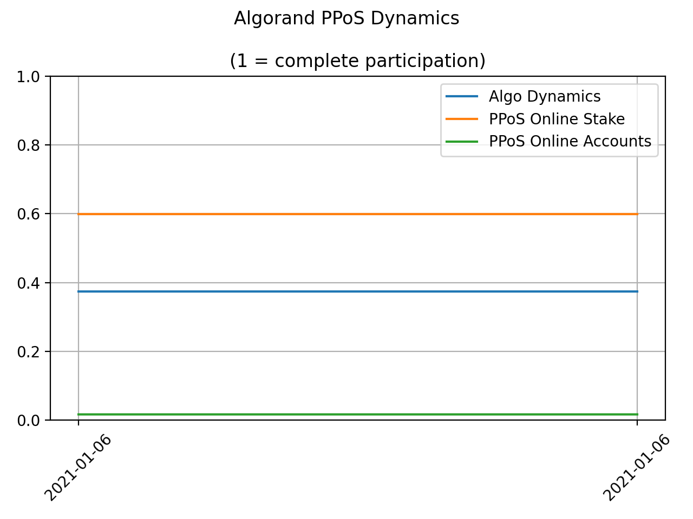
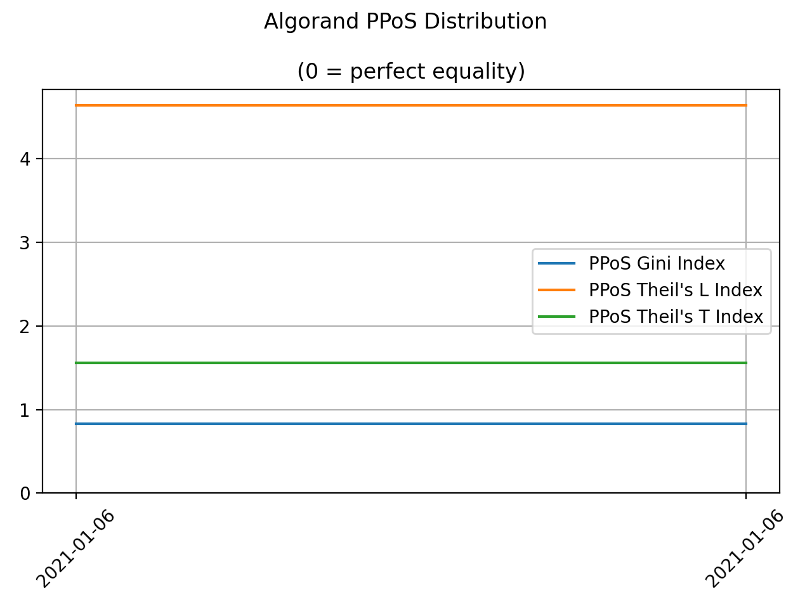
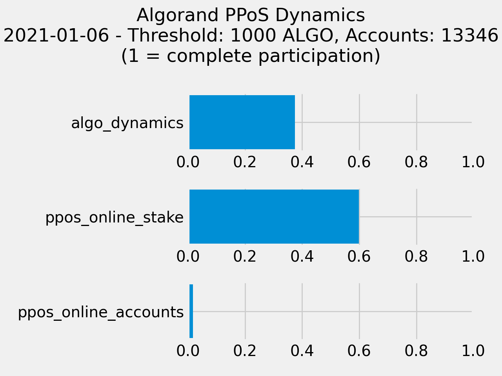
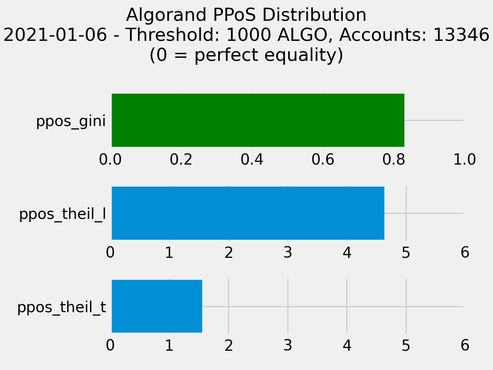

```
 _______  _______           ______    ______
|_   __ \|_   __ \        .' ____ \  |_   _ `.
  | |__) | | |__) | .--.  | (___ \_|   | | `. \ .---.  _   __
  |  ___/  |  ___// .'`\ \ _.____`.    | |  | |/ /__ \[ \ [  ]
 _| |_    _| |_   | \__. || \____) |  _| |_.' /| \__., > '  <
|_____|  |_____|   '.__.'  \______.' |______.'  '.__.'[__]`\_]

Algorand Pure Proof of Stake Decentralization Index (by cusma)
```

# PPoS Dex: Algorand Pure Proof of Stake Decentralization Index monitoring
## What's PPoS Dex?
**PPoS Dex** is a CLI tool with which you can monitor Algorand Pure
Proof of Stake Decentralization Index. The application is ment to be
fully trustless, so you can autonomulsy read Algorand blockchain, do
your math and publish your indexes evaluation on-chain if you want.

Otherwise, if you prefer, you can simply use the data provided by
[PPoS Dex Oracle](https://algoexplorer.io/address/WIPE4JSUWLXKZZK6GJ6VI32PX6ZWPKBRH5YFRJCHWOVC73P5RI4DGUQUWQ).

PPoS Dex plots nice data analytics too (some examples later in this README).

So what **"Decentralization Index"** actually means?

#### Disclaimer
PPoS Dex has not been audited nor officially approved by the Algorand Foundation.
This tool is ment to be only a personal attempt to provide to Algorand community
some stats on the evolution of their ecosystem. **Algorand's decentralization is a
common good**, but it will not happen by itself: the community as a whole should
embrace the path towards the decentalization jointly with the Algorand Foundation,
commiting to preserve it.

## Introduction
Blockchain technology arose to fulfil the promise of the genesis and transfer of
digital native value in disintermediated, safe, decentralized and scalable way.
Billions of people on the planet would have the possibility of transacting
without borders or barriers within a unique global distributed computational
infrastructure that cancel out the needing of third trusted parties in between.

As well as exchange of digital information in the Internet era relies on
Communication Protocols, the **exchange of digital value relies on Consensus
Protocols**: combining distributed computation, cryptography and game theory
into a mathematical equilibrium the **Consensus Protocols are the engines that
power Blockchains**, keeping the history of digital value unique, consistent
and tamper-proof within a single distributed data ledger on a global scale.

Blockchains' technological performances depend on their Consensus Protocols.
At the beginning of this technological journey the so-called Proof of Work
(PoW) consensus protocols powered the first generation of Blockchains, with the
merit of showing the existence of digital native value but at the same time
facing the limitation of their own foundation: running a planetary
computational battle one against the other just to validate the next block of
data takes a lot of time, with unacceptable waste of energy. In fact, like
"Proof of Work" suggests itself, showing off a personal commitment in the
ecosystem through the allocation of computational and energetic resources is at
the core of this consensus mechanism. However, Blockchains that run on PoW fail
in fulfilling the promise of scalability, decentralisation, transaction speed
and costs ending up relying on energetically inefficient centralised
computational farms.

**The planet Earth can no longer afford unsustainable technologies**.

Here is where Algorand steps in: thanks to the brilliant work of Prof. Silvio Micali,
a new orchestration of state-of-art distributed computation, cryptography
and game theory turned the original blockchains' aspirations into the brand new [Algorand Pure Proof
of Stake consensus protocol](https://developer.algorand.org/docs/algorand_consensus/).

### Algorand Pure Proof of Stake Consensus
Thanks to Algorand Pure Proof of Stake (PPoS) consensus mechanism, a unique
committee of users is randomly and secretly selected to approve every block,
through a [Verifiable Random Function](https://developer.algorand.org/docs/algorand_consensus/#verifiable-random-function)
(VRF). This cryptographic primitive acts like a fair, tamper-proof, secure and
provable cryptographic sortition, in which users are free to take part as long
as they own any amount of Algorand's native cryptocurrency, named ALGO, registered
online as "participating". Each online ALGO could be seen as a ticket of
this cryptographic lottery, that runs secretly in parallel on Algorand network's
nodes, with minimal hardware requirements and neglectable energy consumption.

Algorand permissionless Consensus protocol solves blockchains' trilemma
acheiving at the same time:

1. Scalability
2. Security
3. Decentralization

**The point is: can we measure these properites?**

### Scalability
Scalability can be quantified in serveral ways:

- PPoS finalized transactions per second
- PPoS transactions cost
- PPoS power consumption
- PPoS node minimal hardware requirements

Thanks to its unique consensus protocol Algorand brings the number of finalized
transactions per second from few dozen achieved by PoW up to 1000 and shrinks
the transactions' confirmation time form PoW’s dozen of minutes to just 4.5
seconds, with no waste of energy, neglectable transaction’s cost (0.001 ALGO)
and no hardware barriers. So we have quantitative evidence of Algorand scalability.

### Security
Quantify security is not that simple and out of the scope of this README. At
the time of writing (Sep 2nd 2023) Algorand never experienced a downtime since
the genesis block (June 2019).

### Decentralization
Users participating in Algorand Consensus do not delegate their votes, do not
need a minimum stake to take part in the PPoS and do not need to bond their
ALGO stake.

In fact, anyone willing to take part in Pure Proof of Stake consensus protocol
is welcome to do it, showing the real power of Algorand’s decentralization.

Algorand is both a digital and physical infrastructure made of:

- Software: in the form of Algorand native cryptocurrency (the ALGO),
  representing the power that each member of the ecosystem may have over
  the PPoS consensus mechanism

- Hardware: in the form of a global network composed by [Relay Nodes
  and Participation Nodes](https://developer.algorand.org/docs/run-a-node/setup/types/)

We will adopt the following hypotesis:

**Assumption 1**

We will not consider here the degree of geo-delocalization of the physical
infrastrucutre. More insights on this topic can be found [here](https://databricks.com/blog/2020/10/08/analyzing-algorand-blockchain-data-with-databricks-delta.html).

**Assumption 2**

Since a permissionless and public network is pseudonymous by design is there no
way to know if differents public keys belong to the same user. So, we will make
the assumption that **each public key belongs to a different participants in the
Algorand PPoS consensus**, with their own skin in the game.

So how can we quantify PPoS Decentralization? Here is a proposal.

## Pure Proof of Stake Decentralization Index
When mathematicians do not know equations' solutions or when physicists do
not know how to measure physical properties, they usually start investigating if
that solutions or that properties have upper or lower bounds.

In order to reach a common understanding of what measuring decentralization
means in this proposal, we should agree on some definitions.

To do that we will go back to the comparison between Consenus Protocols and
engines we made in the **Introducion**, exploring the concept of efficiency of
a machine.

In 1842 the French physicist [Nicolas Léonard Sadi Carnot](https://en.wikipedia.org/wiki/Nicolas_L%C3%A9onard_Sadi_Carnot) discovered that the
efficecy of any classical thermodynamic engine, that converts heat into work
(or vice versa), **must be lower than a theoretical upper bound** represented by
the efficency of a purely ideal machine, named Carnot engine after him. Such as
"perfect" engine is a purely theoretical construct and cannot be built in
practice.

This is **probably the most elegant and general result in classical physics**, it
implies that any system undergoing any kind of thermodinamic cycle can only
tend to the efficiency of a Carnot engine operating under the same conditions,
but **will never reach it**, no matter how cleverly that system has been designed.

In the same way we will try to define an equivalent of a Carnot engine for the
PPoS consensus.

**Does such theoretical decentralization upper bound exsist?**

**When we should say that the Algorand PPoS consenus is completely decentralized?**

The ALGO has a **total supply of 10B**, hardcoded in the genesis block, that will
flow into the ecosystem according to the
[Algorand Dynamics](https://algorand.foundation/the-algo/algo-dynamics) and
spread across participants according to their economical choices.

Since the probability of being elecetd as block proposer or as member of the
committee of validator is **directly proportional to user's ALGO online stake**,
the distribution of ALGOs into the ecosystem has a foundamental role on PPoS
decentralization.

Let's try first to define an **ideal theoretical conditions of decentralization**.
Then, everything deviating from those conditions will make
PPoS more real and far from platonic ideality.

> 💡 _NOTE: Refer to this [article](https://t.co/aLVGnbgNTZ) for additional
considerations over blockchain decentralization._

### Definitions
We will say that PPoS is **"completely decentralized"** if and only if:

1. All the ALGO genesis supply is circulating in the ecosystem;
2. All the ALGO circulating supply is taking part to the PPoS;
3. All the accounts that owns ALGOs are taking part to PPoS;
4. All the accounts participating in PPoS hold the same amount of ALGO;

Now we need to **quantify each of these 4 statements** to express "how far" we are
with respect the purely theoretical decentralization.

1. `ALGO DYNAMICS = circulating supply / total supply`

    * 0 = no ALGO circulation
    * 1 = complete ALGO circulation


2. `ALGO ONLINE STAKE = total online stake / circulating supply`

   * 0 = no PPoS participation
   * 1 = complete PPoS participation


3. `ONLINE ACCOUNTS = online accounts / existing accounts`

    * 0 = no PPoS participation
    * 1 = complete PPoS participation


The statement 4. essentialy implies a measurement of participating accounts'
inequality. So, we will adopt well-know wealth inequality or concentration
indexes from Macroeconomics field: the [Gini's Index](https://en.wikipedia.org/wiki/Gini_coefficient),
the [Theil's Index](https://en.wikipedia.org/wiki/Theil_index) and the
[Herfindahl–Hirschman Index](https://en.wikipedia.org/wiki/Herfindahl%E2%80%93Hirschman_Index).

**Gini's Index** is a measure of statistical dispersion intended to represent
the wealth inequality within a nation or any other group of people. It can
theoretically range from 0 (complete equality) to 1 (complete inequality).

4. `PPoS GINI INDEX`

    * 1 = complete PPoS inequality
    * 0 = complete PPoS equality

In order to express our PPoS Decentralization Index homogeneously **we will
consider Gini's Index complement** (rather than its original form) in letter
calculations.

**Theil's Indexs** are called **Theil's L** and **Theil's T**, they also
measure the inequality of a distribution among a set of peoples but with
different sensitivity:

- `THEIL's L INDEX` is sensitive to differences at the lower end of the
  distribution (small ALGO amounts);

- `THEIL's T INDEX` is more sensitive to differences at the top of the
  distribution (large ALGO amounts);

both can theoretically range from 0 (complete equality) to +inf (complete
inequality) and represent two different evaluations of inequality, based on
what we tend to consider worse: having even a few small ALGO amounts among
many large ones or having even only a very few large ALGO amounts among many
small ones.

**Herfindahl–Hirschman Index (HHI)** is another indicator of concentration, used
mainly to measure the degree of competition in a given market. It can
theoretically range from 0 (perfectly competitive market) to 1 (monopoly).

- `ALGO HHI INDEX` considers all ALGO stakes, whether they participate in
  the PPoS or not;

- `PPoS HHI INDEX` considers only ALGO stakes that are participatinf in the
  PPoS;

For sake of completenss we will evaluate them all.

### PPoS Dex Index
Combining all the 4 statements, we know "how far" PPoS is from its purely
theoretical decentralization.

So we will measure this distance form ideality as:

- `PPoS DEX INDEX V3 = ALGO DYNAMICS * ALGO ONLINE STAKE * ONLINE ACCOUNTS * (1 - PPoS HHI)`

    * 0 = complete PPoS centralization
    * 1 = complete PPoS decentralization

Being aware that the PPoS only tends to the ideal condition, never reaching it.

> ⚠️ _NOTE: PPoS Dex Index V1 and V2 were based on PPoS Gini Index instead of PPoS HHI._

## PPoS Dex CLI
### Step 1 - Install dependencies
PPoS Dex uses Poetry for dependencies management.

```shell
$ poetry install
```

### Step 2 - Clients
PPoS Dex interacts with Algorand blockchain both thorugh a Node and an Indexer.
You may want to choose:

1. Your local hosted Node and Indexer (see [AlgoKit](https://github.com/algorandfoundation/algokit-cli))
2. A third party Node and Indexer APIs

PPoS Dex uses AlgoNode APIs by default.

If you prefer using your local hosted Node and Indexer or other API providers,
the following environment variables must be set:

```shell
$ export ALGOD_SERVER=...
$ export ALGOD_TOKEN=...
$ export INDEXER_SERVER=...
$ export INDEXER_TOKEN=...
```

### Step 3 - Usage
Intreacting with PPoS Dex from your CLI is pretty easy, just ask for help:

**Input**
```shell
$ python3 ppos_dex.py --help
```
**Output**
```
Algorand PPoS Decentralization Index.

Usage:
  ppos_dex.py publish [--algo-threshold=<t>] [--localhost]
  ppos_dex.py plot [--publisher=<p>] [--algo-threshold=<t>] [--start-block=<s>] [--end-block=<e>] [--localhost]
  ppos_dex.py snapshot [--publisher=<p>] [--algo-threshold=<t>] [--start-block=<s>] [--localhost]
  ppos_dex.py export [--publisher=<p>] [--algo-threshold=<t>] [--start-block=<s>] [--end-block=<e>] [--localhost]
  ppos_dex.py health [--localhost]
  ppos_dex.py [--help]

Commands:
  publish   Publish PPoS Dex data. Requires ALGO_MNEMONIC environment variable.
  plot      Plot PPoS Dex timeseries.
  snapshot  Plot latest PPoS Dex data point.
  export    Export PPoS Dex data to `.csv`.
  health    Check Algod and Indexer status.

Options:
  -t, --algo-threshold=<t>  [default: 1000]
  -p, --publisher=<p>       [default: WIPE4JSUWLXKZZK6GJ6VI32PX6ZWPKBRH5YFRJCHWOVC73P5RI4DGUQUWQ]
  -s, --start-block=<s>     [default: 11476070]
  -e, --end-block=<e>
  -h, --help
```

### Publish PPoS Dex data
Contribute publishing trustless reliable data on Algorand blockchain paying
just the minimum network fee (currently 0.001 ALGO).

Set your publisher mnemonic as environment variable:
```shell
$ export ALGO_MNEMONIC=...
```

**Input**
```bash
$ python3 ppos_dex.py publish
```
**Options**
1. `[--algo-threshold=<at>]` consider only accounts that own more than this threshold (default: 1000 ALGO);
2. `[--localhost]` select local hosted Node and Indexer or other API providers;

Is worth noting that lower values of `[--algo-threshold=<at>]` will require more
querying efforts, so you should avoid going under default threshold, expecially
if you are using a third party API service.

**Output**
```shell
{
  "algo_threshold": 1000,
  "accounts": 13346,
  "algo_dynamics": 0.3741854092978301,
  "ppos_online_stake": 0.598241416943984,
  "ppos_online_accounts": 0.01715869923572606,
  "ppos_gini": 0.829793933948626,
  "ppos_theil_l": 4.640220128476622,
  "ppos_theil_t": 1.5593480873810057,
  "ppos_dex": 0.0006537665878508702,
  "timestamp": "2021-01-06 00:22:09.607573"
}
```

You can then find your result published on-chain ([example](https://algoexplorer.io/tx/NPAAMBUEAIIYJJDFZWMYAHJBBSXDO2PV5TTSCD3SKWNBCLOU2AYA)).

### Plot PPoS Dex timeseries
Plot PPoS Dex Index timeseries data published by PPoS Dex Oracle (or by
yourself).

**Input**
```shell
$ python3 ppos_dex.py plot
```
**Options**
1. `[--publisher=<p>]` publisher account address (default: PPoS Dex Oracle account);
2. `[--algo-threshold=<t>]` plot only data of accounts that own more than this threshold (default: 1000 ALGO);
3. `[--start-block=<s>]` plot data from this block (if availables);
4. `[--end-block=<e>]` plot data until this block;
5. `[--localhost]` select local hosted Node and Indexer or other API providers;

**Output**




### Plot PPoS Dex snapshot
Take a snapshot of PPoS Dex Index data published by PPoS Dex Oracle (or by
yourself).

**Input**
```shell
$ python3 ppos_dex.py snapshot
```
**Options**
1. `[--publisher=<p>]` publisher account address (default: PPoS Dex Oracle account);
2. `[--algo-threshold=<t>]` plot only data of accounts that own more than this threshold (default: 1000 ALGO);
3. `[--start-block=<s>]` plot data from this block (if availables);
4. `[--localhost]` select local hosted Node and Indexer or other API providers;

**Output**




### Export Plot PPoS Dex data
Export PPoS Dex Index data published by PPoS Dex Oracle (or by yourself) to `csv` file.

**Input**
```shell
$ python3 ppos_dex.py export
```
**Options**
1. `[--publisher=<p>]` publisher account address (default: PPoS Dex Oracle account);
2. `[--algo-threshold=<t>]` plot only data of accounts that own more than this threshold (default: 1000 ALGO);
3. `[--start-block=<s>]` plot data from this block (if availables);
4. `[--end-block=<e>]` plot data until this block;
5. `[--localhost]` select local hosted Node and Indexer or other API providers;

**Output**
```shell
ppos_dex_data.csv
```

## Conclusion
If you think that PPoS Dex Index represents a good and useful tool please consider
tipping the PPoS Dex Oracle account:

`WIPE4JSUWLXKZZK6GJ6VI32PX6ZWPKBRH5YFRJCHWOVC73P5RI4DGUQUWQ`

to cover the transactions fee.
