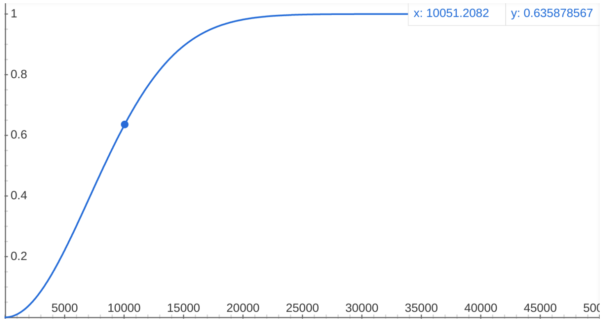

# Nodes Hardware Decentralization

---

Another relevant factor to evaluate a network's decentralization is the rate of
growth of the overall "nodes' hardware" connected to the network. It is
important to remark that this metric takes into account nodes' _"growth rate"_
rather than just nodes' _"absolute number"_, for the following reason: one
could easily say that 10 nodes are better than 1 node, or that 100 nodes are
better than 10 nodes but, are 1.5 millions nodes really much better than 1
million nodes?

What we are trying to state here is that the number of nodes should be analyzed
as a _growth phenomenon_ that tends to reach a _steady state_ after which the
addition of other nodes do not really impact decentralization in a linear and
proportional way.

_Sigmoid functions_, like _Logistic function_ or _Error function_, are a good
way to model growth phenomena, their characteristic _S_-shaped curve perfectly
models a system, like a network, that exhibits a progression from small
beginnings, that accelerates and approaches a climax over time.

_Cumulative Distribution functions_, similarly, contain information on a
phenomenon regarding its growth or distribution before or after a certain
"inflection point".

We propose to model the Nodes Hardware Decentralization as a _Cumulative
Distribution_:

\\[ d_{N} = 1 - e^{-\left(\frac{N}{\lambda}\right)^k} \\]

that can theoretically range from 0 (no hardware growth) to 1 (complete
hardware growth).

The parameters \\(k\\) and \\(\lambda\\) should be calibrated to best fit the
growth phenomenon with respect to an "inflection point". The parameter \\(k\\)
defines the speed of growth of the phenomenon. The parameter \\(\lambda\\)
defines the order of magnitude of the inflection point for a given growth
phenomenon.

How to tune \\(\lambda\\) for a distributed blockchain network could be debated
around the following question: "what is the reasonable order of magnitude of
nodes at which we can say that a network has grown sufficiently?".

Our opinion is that a meaningful "inflection point" for a decentralized network
should be greater than a few dozens or a few hundreds nodes, in particular,
given the context of the analysis, we think adequate and reasonable to set:
\\(k = 2\\) for the speed of growth and \\(\lambda = 10^4\\) for the inflection
point magnitude:

\\[ d_{N} = 1 - e^{-\left(\frac{N}{10^4}\right)^2} \\]

