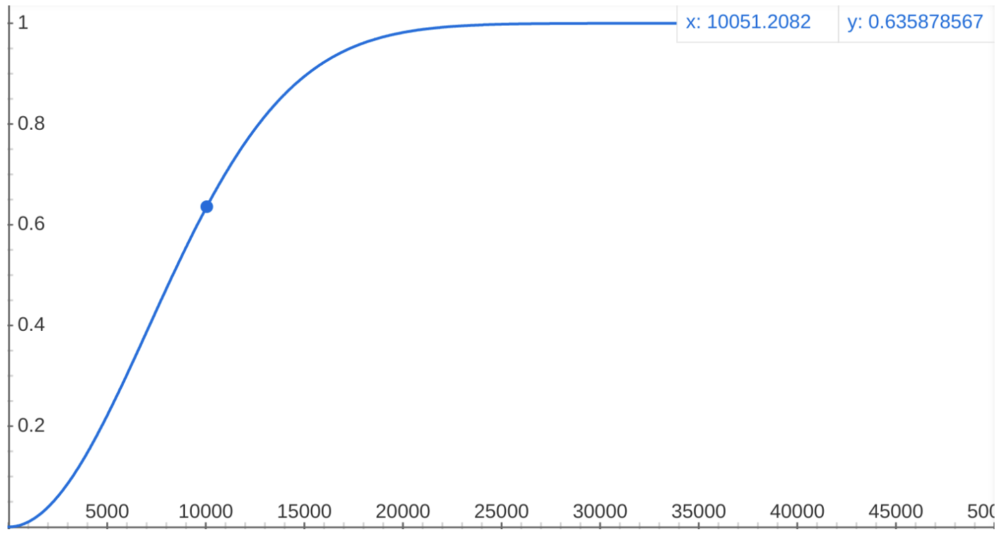

# Nodes Hardware Decentralization

---

The first factor for the evaluation of networks' decentralization is the _rate
of growth_ of the overall "nodes' hardware" connected to the network.

It is important to remark that this metric takes into account nodes' _"growth rate"_
rather than just nodes' _"absolute number"_, for the following reason: one could
easily say that 10 nodes are better than 1 node, or that 100 nodes are better than
10 nodes. But, are 1.5 millions nodes really _much better_ than 1 million nodes?

What we are trying to state here is that the number of nodes should be analyzed
as a _growth phenomenon_, that tends to reach a _steady state_ after which the
addition of other nodes do not really impact decentralization in a linear and proportional
way.

_Sigmoid functions_, like _Logistic function_ or _Error function_, are a good way
to model growth phenomena. Their characteristic _S_-shaped curve perfectly models
a system, like a network, that exhibits a progression from small beginnings, that
accelerates and approaches a climax over time.

_Cumulative Distribution_ functions, similarly, contain information on a phenomenon
regarding its growth or distribution before or after a certain _"inflection point"_.

We propose to model the **Nodes Hardware Decentralization** as a _Cumulative Distribution_:

\\[ d_{N} = 1 - e^{-\left(\frac{N}{\lambda}\right)^k} \\]

that can theoretically range from 0 (no hardware growth) to 1 (complete hardware
growth).

The parameters \\(k\\) and \\(\lambda\\) should be calibrated to best fit the growth
phenomenon with respect to the growth _"inflection point"_:

- \\(k\\) defines the speed of growth of the phenomenon;
- \\(\lambda\\) defines the order of magnitude of the inflection point for a given
growth phenomenon.

How to tune \\(\lambda\\) for a Blockchain network could be debated around the following
question:

**What is the reasonable order of magnitude of nodes at which we can say that a
Blockchain network has grown sufficiently?**

Our opinion is that a meaningful _decentralization "inflection point"_ for a Blockchain
network should be greater than a few dozens or a few hundreds nodes. In particular,
given the context of the analysis, we think adequate and reasonable to set:

- \\(k = 2\\) for the speed of growth;
- \\(\lambda = 10^4\\) for the inflection point magnitude.

\\[ d_{N} = 1 - e^{-\left(\frac{N}{10^4}\right)^2} \\]

---

> Since monitoring the number of connected validators nodes would require additional
> effort and resources, for the scope of this project we consider a _perfect_ Nodes
> Hardware Decentralization (\\( d_N = 1 \\)), leaving the refinement of the calculation
> of this decentralization factor to future works.
>
> Community contribution to Nodes Hardware Decentralization monitoring are welcome!
> [PPos Dex GitHub](https://github.com/cusma/pposdex).
