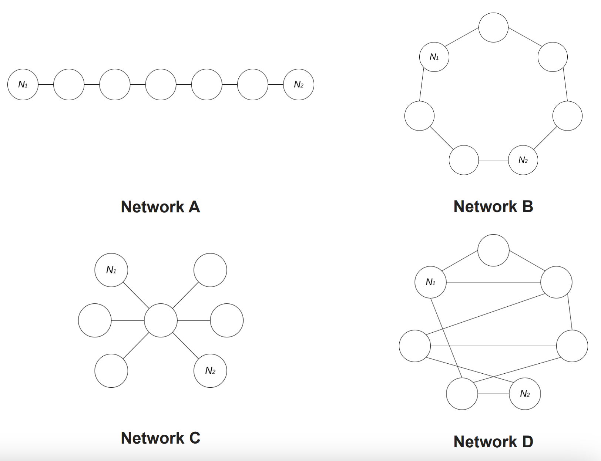

# Network Topology

---

Blockchain's public ledger is distributed across multiple nodes in a network.
All these nodes work together, using the same set of software rules (the
_Consensus Protocol_), to verify transactions that are eventually added to the
finalized ledger.

In order to keep the state of such a distributed system unique, coherent and
synchronized the information must flow across the network, ensuring efficient
paths of communication between the nodes.

So, _how_ nodes are connected to each other, forming a network, is another
relevant factor of decentralization, commonly known as _Network Topology_.

The message passing through the network can be achieved by routing the traffic
with different techniques. In Algorand, at the time of writing (Sep 2023),
information is spread across the network through “message gossiping” handled by
the Relay Nodes, which route blocks to all connected nodes finding highly
efficient communication paths and reducing communication hops. Complementary
fully P2P communications paths are under active research.

Paths of communication are therefore essential to ensure that no one is
excluded from the communication: everybody should be able to talk and listen to
each other without relying on a few dominant paths.

**The more communication paths between nodes the more robust and decentralized
the network.**

Let’s try to visualize some communication paths examples between two generic
nodes \\(N_1\\) and \\(N_2\\) connected through graphs that are intuitively
different from each other:

We can intuitively glimpse the difference between networks \\(A\\), \\(B\\),
\\(C\\) and \\(D\\) with respect to the concept of “topology decentralization”.
Graph \\(D\\) is intuitively “more decentralized” than graph \\(A\\), since it
offers a larger set of communications paths between nodes \\(N_1\\) and
\\(N_2\\).

Graph theory and network analysis define rigorous indicators of centrality,
distribution and decentralization of a distributed system, assigning numbers or
rankings to nodes within a graph corresponding to their network position.

Networks in which traffic is obliged to pass through a few dominant nodes, for
example, are less “decentralized” than networks in which the traffic is free to
flow through several possible communication paths.

Other metrics like [Betweenness Centrality](https://en.wikipedia.org/wiki/Betweenness_centrality)
or [Closeness Centrality](https://en.wikipedia.org/wiki/Closeness_centrality)
are measures of centrality in a graph related to the evaluation of the shortest
paths.

One possible metric that fits well our requirements for **Network Topology
Decentralization** (being a per-unit metric bounded between 0 and 1) is the
_Central Point Dominance_ (\\(CPD\\)), which measures the maximum centrality of a
node in a graph. This metric ranges from 0 to 1:

- 0 represents a network in which there is no node such that all shortest paths
have to pass through it;
- 1 means all routes have to pass through that node.

Network C in the examples above, for instance, is a graph with _Central Point
Dominance_ equal to 1, since any message must pass through the central node to
reach others.

In order to stay compliant with the rest of decentralization metrics used in
this project (1 meaning maximum decentralization), we will consider the _one's
complement_ of the _Central Point Dominance_ so:

\\[ d_T = 1 - CPD \\]

---

> Network Topology Decentralization does not consider the degree of
> _geo-delocalization_ of the physical infrastrucutre. More insights on this
> topic can be found [here](https://databricks.com/blog/2020/10/08/analyzing-algorand-blockchain-data-with-databricks-delta.html).
> For the scope of this project we consider a _perfect_ Network Topology
> Decentralization (\\( d_T = 1 \\)), leaving the refinement of the calculation
> of this decentralization factor to future works.
>
> Community contribution to Nodes Hardware Decentralization monitoring are
> welcome! [PPos Dex GitHub](https://github.com/cusma/pposdex).
